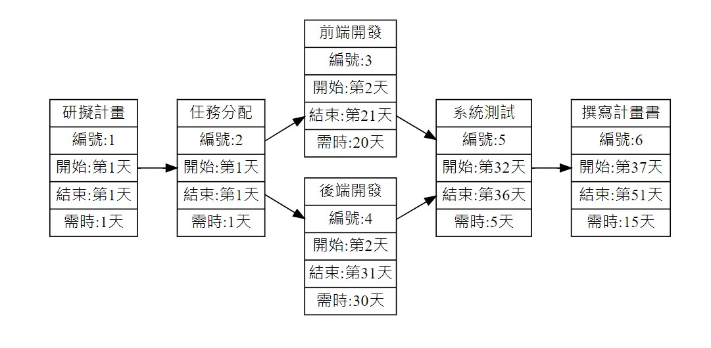
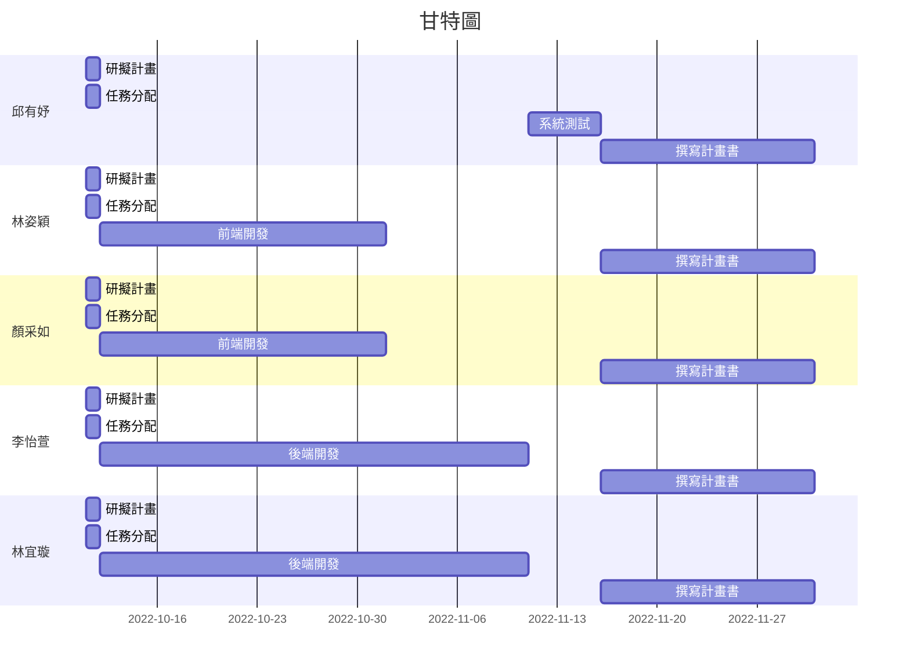

# SystemAnalysis-group15

| 職位 | 學號 | 姓名 | 任務 |
| :---: | :---: | :---: | :---: |
| **組長** | C109118201 | [邱有妤](https://github.com/Wendy30418/2022-3b/blob/main/README.md) | 研擬計畫、系統測試、撰寫計畫書 |
| 組員 | C109118211 | [林姿穎](https://github.com/abcdefuuuu/2022-3b/blob/main/README.md) | 研擬計畫、前端開發、撰寫計畫書 |
| 組員 | C109118221 | [顏采如](https://github.com/0808jessie/2022-3b/blob/main/README.md) | 研擬計畫、前端開發、撰寫計畫書 |
| 組員 | C109118215 | [李怡萱](https://github.com/bovcu13/2022-3b) | 研擬計畫、後端開發、撰寫計畫書 |
| 組員 | C109118250 | [林宜璇](https://github.com/Hsxxnil/2022-3b/blob/main/README.md) | 研擬計畫、後端開發、撰寫計畫書 |

***
# PERT

***
# 甘特圖

