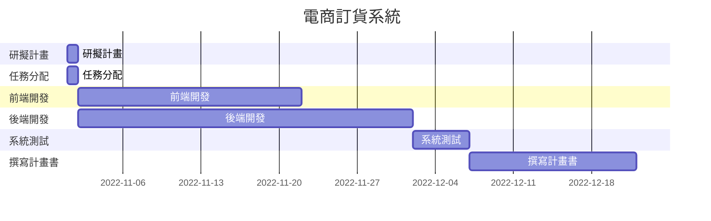
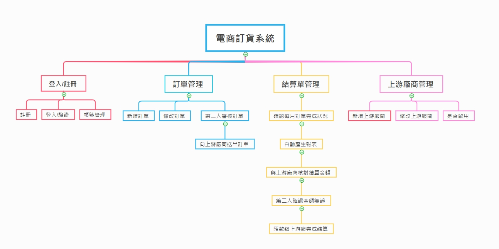
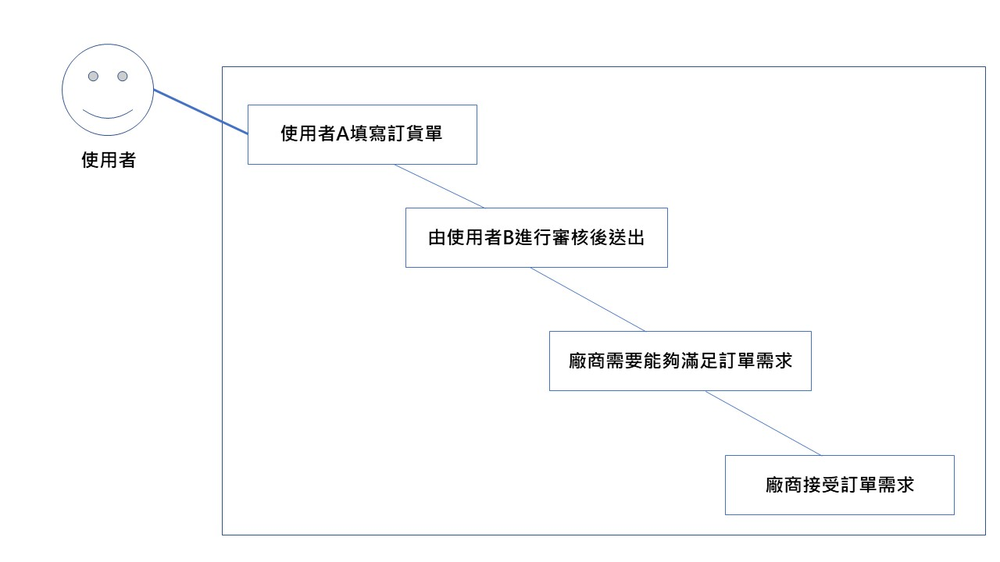
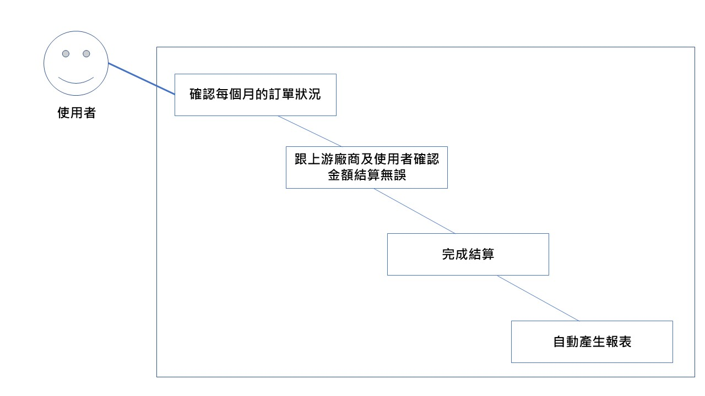
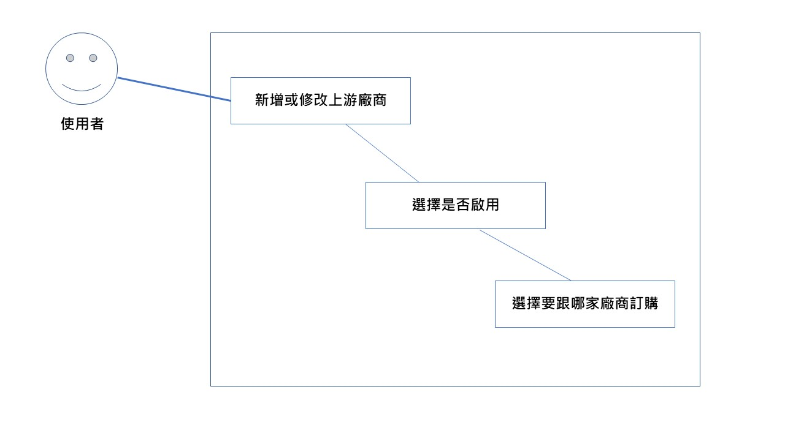

# 電商訂貨系統
### 說明
1. 電商透過拍賣平台取得消費者的訂單，將每日產品需求統整並填入此訂貨系統，且填單者填完後由另一位同事審核，確認無誤後，向上游廠商進行訂購。
2. 系統每月依據使用者回報的訂單完成狀況，自動產生報表讓使用者與上游廠商進行核對，確認無誤再進行付款。
### 目的
減少電商倉儲成本，達成及時訂購、出貨。
***
### 分工
| 職位 | 學號 | 姓名 | 任務 |
| :---: | :---: | :---: | :---: |
| **組長** | C109118201 | [邱有妤](https://github.com/Wendy30418/2022-3b/blob/main/README.md) | 研擬計畫、系統測試、撰寫計畫書 |
| 組員 | C109118211 | [林姿穎](https://github.com/abcdefuuuu/2022-3b/blob/main/README.md) | 研擬計畫、前端開發、撰寫計畫書 |
| 組員 | C109118221 | [顏采如](https://github.com/0808jessie/2022-3b/blob/main/README.md) | 研擬計畫、前端開發、撰寫計畫書 |
| 組員 | C109118215 | [李怡萱](https://github.com/bovcu13/2022-3b) | 研擬計畫、後端開發、撰寫計畫書 |
| 組員 | C109118250 | [林宜璇](https://github.com/Hsxxnil/2022-3b/blob/main/README.md) | 研擬計畫、後端開發、撰寫計畫書 |
### PERT/CPM

### 甘特圖

***
### 功能性需求
1. 可透過訂單管理盤點資訊，將每日產品需求統整向上游廠商下單。
2. 系統每月確認訂單完成狀況，自動產生報表讓使用者與上游廠商核對結算金額。
3. 透過系統來管理上游廠商資訊，下單時也可以讓使用者選擇走向哪間上游廠商訂購。
### 非功能性需求
1. (可靠度)自己盤點訂單，浪費時間又容易出錯，使用系統統整後再進行審核，更能增加準確度。
2. (使用性)設計人性化網頁、系統簡單易操作。
3. (反應時間)點擊下單後3秒可以成功送出訂單，能有流暢的體驗。
### 功能分解圖(FDD)

### 需求分析
1. 使用者可透過註冊/登入來管理帳號。
2. 使用者可透過訂單管理來新增、修改、審核訂單。審核通過即可向上游廠商下訂單。
3. 使用者可透過結算單管理來見識本月訂單狀況，並匯出結算單，若結算單無誤即可向上游廠商進行匯款以完成結算。
4. 使用者可透過上游廠商管理來新增、修改及管理上游廠商資訊。
### 使用案例說明

| 使用案例名稱 | 訂單管理 |
| --- | --- |
| 行動者 | 系統使用者 |
| 說明 | 向上游廠商下單 |
| 完成動作 | 1.使用者A填寫訂貨單  2.由使用者B進行審核後送出|
| 替代方法 | 若使用者審核未通過，則退回後進行修改 |
| 先決條件 | 廠商需要能夠滿足訂單需求 |
| 後置條件 | 廠商接受訂單需求 |
| 假設 | 無 |
---

| 使用案例名稱 | 結算單管理 |
| --- | --- |
| 行動者 | 系統使用者 |
| 說明 | 確認每個月的訂單狀況後自動產生報表 |
| 完成動作 | 跟上游廠商及使用者確認金額結算無誤後即可完成結算|
| 替代方法 | 跟上游廠商及使用者確認金額結算若有誤，則要重新確認 |
| 先決條件 | 上游廠商及使用者兩邊金額需要一樣 |
| 後置條件 | 確定一樣後即可產生報表 |
| 假設 | 無 |
---

| 使用案例名稱 | 上游廠商管理 |
| --- | --- |
| 行動者 | 系統使用者 |
| 說明 | 可以新增或修改上游廠商 |
| 完成動作 | 1.系統可以新增滿足需求的廠商  2.新增完後可以選擇是否啟用  3.選擇要跟哪家廠商訂購|
| 替代方法 | 1.系統可以修改滿足需求的廠商 2.修改完後可以選擇是否啟用 3.選擇要跟哪家廠商訂購|
| 先決條件 | 廠商需要能夠滿足訂單需求 |
| 後置條件 | 選擇廠商後即可進行訂購 |
| 假設 | 無 |
---
