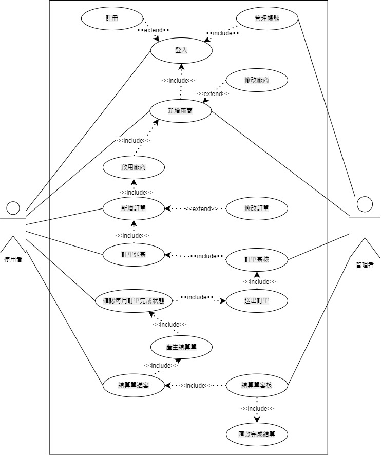

### 功能性需求
1. 可透過訂單管理盤點資訊，將每日產品需求統整向上游廠商下單。
2. 系統每月確認訂單完成狀況，自動產生報表讓使用者與上游廠商核對結算金額。
3. 透過系統來管理上游廠商資訊，下單時也可以讓使用者選擇走向哪間上游廠商訂購。
### 非功能性需求
1. 可靠度：自己盤點訂單，浪費時間又容易出錯，使用系統統整後再進行審核，更能增加準確度。
2. 使用性：設計人性化網頁、系統簡單易操作。
3. 反應時間：點擊下單後3秒可以成功送出訂單，能有流暢的體驗。
***
### 功能分解圖(FDD)

### 需求分析
1. 使用者A、使用者B透過註冊/登入來管理帳號。
2. 使用者A透過訂單管理來新增、修改訂單，使用者B審核訂單，審核通過即可向上游廠商下訂單。
3. 使用者A透過結算單管理來見識本月訂單狀況，並匯出結算單，若使用者B確認結算單無誤即可向上游廠商進行匯款以完成結算。
4. 使用者A、使用者B透過上游廠商管理來新增、修改及管理上游廠商資訊。
***
### 使用案例說明

| 使用案例名稱 | 訂單管理 |
| --- | --- |
| 行動者 | 系統使用者 |
| 說明 | 向上游廠商下單 |
| 完成動作 | 1.使用者A填寫訂貨單  2.由使用者B進行審核後送出 |
| 替代方法 | 若使用者審核未通過，則退回後進行修改 |
| 先決條件 | 廠商需要能夠滿足訂單需求 |
| 後置條件 | 廠商接受訂單需求 |
| 假設 | 無 |

| 使用案例名稱 | 結算單管理 |
| --- | --- |
| 行動者 | 系統使用者 |
| 說明 | 確認每個月的訂單狀況後自動產生報表 |
| 完成動作 | 跟上游廠商及使用者確認金額結算無誤後即可完成結算 |
| 替代方法 | 跟上游廠商及使用者確認金額結算若有誤，則要重新確認。 |
| 先決條件 | 上游廠商及使用者兩邊金額需要一樣 |
| 後置條件 | 確定一樣後即可產生報表 |
| 假設 | 無 |

| 使用案例名稱 | 上游廠商管理 |
| --- | --- |
| 行動者 | 系統使用者 |
| 說明 | 可以新增或修改上游廠商 |
| 完成動作 | 1.新增上游廠商  2.新增完後可以選擇是否啟用 |
| 替代方法 | 廠商資料若更新，可進進行修改。|
| 先決條件 | 廠商需要能夠滿足訂單需求 |
| 後置條件 | 選擇廠商後即可進行訂購 |
| 假設 | 無 |
***
### Figma
[電商訂貨系統](https://www.figma.com/proto/XmyLzrCiIyoQD8u9u0cJND/%E9%9B%BB%E5%95%86%E8%A8%82%E8%B2%A8%E7%B3%BB%E7%B5%B1?node-id=1%3A2&scaling=min-zoom&page-id=0%3A1&starting-point-node-id=1%3A2&show-proto-sidebar=1) 

